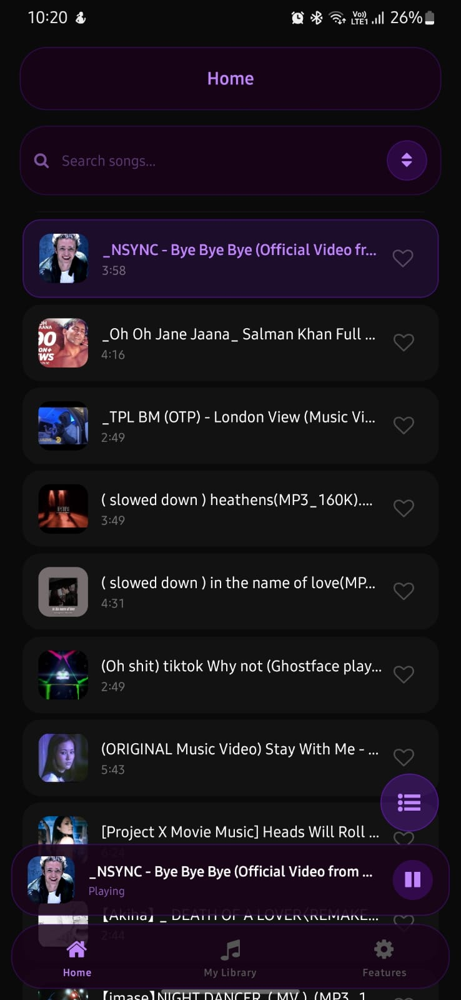
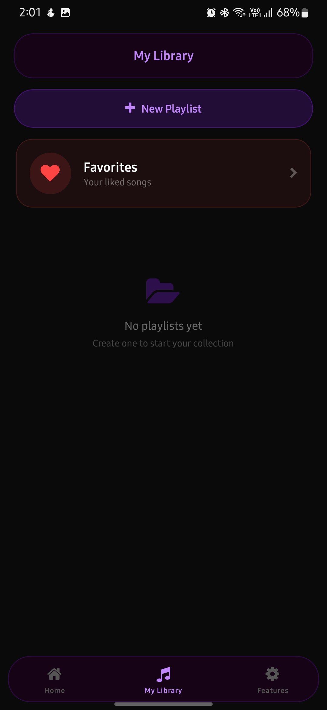
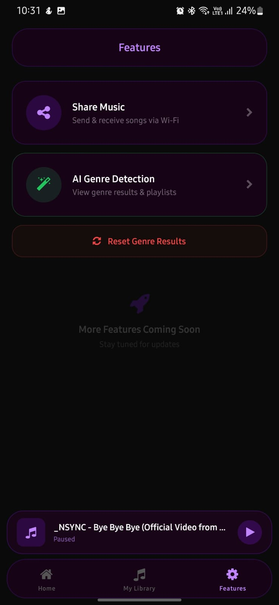
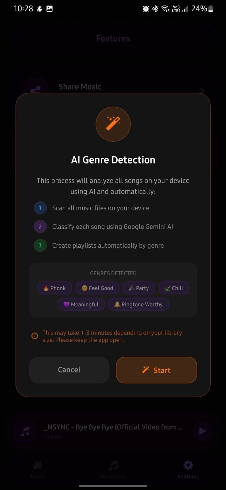
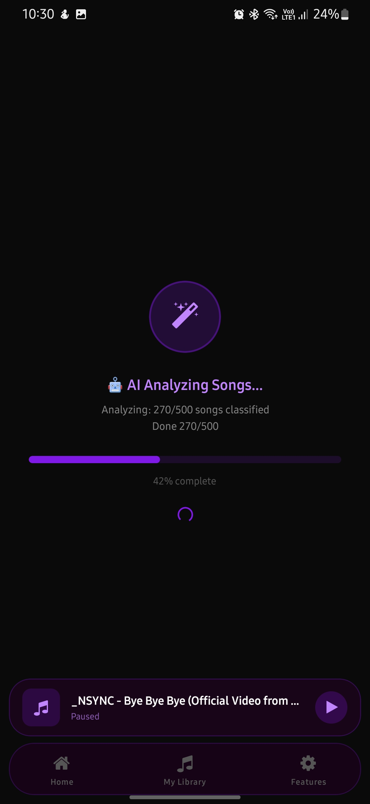
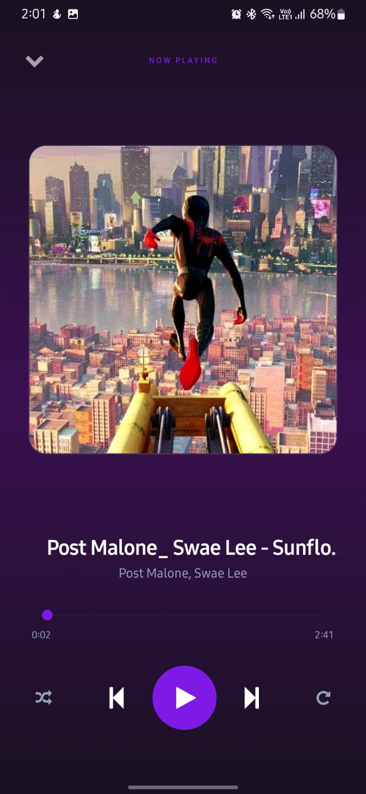
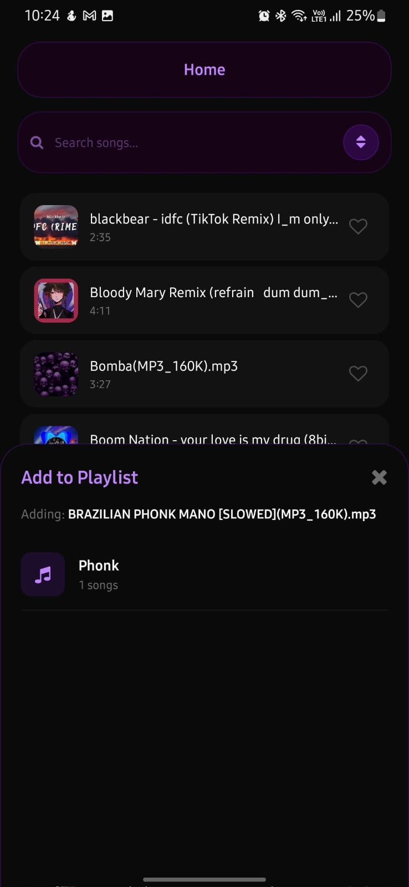

# Msick

<p align="center">
  
  
  
</p>
<p align="center">
  
  
  
</p>
<p align="center">
  
</p>

<p align="center">
  
  
  
  
  
</p>

---

> [!NOTE]
> Msick is currently in development. While functional, it is undergoing continuous performance optimizations for large music libraries and refined AI processing.

Msick is a high-performance, local-first music application built with **React Native** and **Expo**. It transforms your local music library into an intelligent, AI-powered experience with natural language searching, automated multi-genre classification, and robust relational storage.

## ✨ Why Msick?

In an era of streaming, Msick brings the power of AI to your **local files**.
- 🔒 **Privacy First:** No cloud tracking. Your library data stays on your device.
- ⚡ **Lightning Fast:** Powered by SQLite for near-instant access even with 10,000+ tracks.
- 🤖 **Intelligence:** Stop manually sorting folders. Let the AI categorize and find music for you.

## 🚀 Core Features

### 💿 High-Fidelity Local Playback
- Full background audio support with lock-screen controls.
- Dynamic queue management with drag-and-drop reordering.
- Shuffle, Repeat (One/All), and Seek functionality.

### 🤖 AI-Driven Multi-Genre Classification
- Automatically organizes your library into **20 curated genres** (e.g., Phonk, Lo-fi, Bollywood, Metal).
- Powered by **Groq API (Llama 3.3 70B)** for human-like understanding of filenames.
- Intelligent fallback to a local keyword-based classifier when offline.

### 🔍 AI Smart Filter (Natural Language Search)
- Search your library using natural language prompts.
- Ask for *"upbeat workout tracks"* or *"chill evening vibes"* and get an instant playlist.
- No more scrolling through endless lists—just ask.

### 🗄️ Relational SQLite Storage
- Professional **SQLite** architecture replacing legacy AsyncStorage.
- Optimized indices for fast genre filtering and playlist management.
- Robust data persistence that scales with your library.

### 🖼️ Smart Metadata & Artwork Caching
- Extracts ID3 tags and high-res album art on-the-fly.
- Employs a custom **FileSystem caching** strategy to store artwork locally, ensuring instantaneous loading without bloating the database.

### 🌐 Peer-to-Peer (P2P) Sharing (WIP)
- Share tracks directly with friends on your local network.
- Uses a built-in TCP socket server—no internet required for transfer.

## 🛠️ Technology Stack

- **Framework:** React Native & Expo (Development Build)
- **Navigation:** Expo Router (Type-safe Tabs Architecture)
- **Database:** SQLite (`expo-sqlite`)
- **AI Engine:** Groq API / Llama 3.x
- **Styling:** TailwindCSS (`NativeWind v4`)
- **Animations:** `React Native Reanimated`
- **Metadata Parsing:** `music-metadata-browser`

## 🏁 Getting Started

### Prerequisites

Msick uses custom native modules. It must run as an **Expo Development Build**.

- [Node.js](https://nodejs.org/) (LTS)
- Android Studio (for Emulator) or a physical Android device.
- Groq API Key ([console.groq.com](https://console.groq.com/))

### Installation

1. **Clone the Repo:**
   ```bash
   git clone <repository-url>
   cd Msick
   ```

2. **Install Dependencies:**
   ```bash
   npm install
   ```

3. **Environment Setup:**
   Create a `.env` file in the root:
   ```env
   EXPO_PUBLIC_GROQ_API_KEY=your_actual_key_here
   ```

### Running the App

1. **Build the Development Client:**
   ```bash
   npx expo run:android
   ```

2. **Start the Dev Server:**
   ```bash
   npm start
   ```

## 🗺️ Roadmap

- [ ] **Waveform Visualizer:** Real-time audio waveform generation for the playback screen.
- [ ] **iOS Support:** Fine-tuning native modules for full iOS compatibility.
- [ ] **Advanced AI Playlists:** Context-aware playlists based on time of day or activity.
- [ ] **Batch Metadata Editing:** Manually edit tags for multiple songs at once.

## 📜 Detailed Documentation

For a technical deep dive into the SQLite schema, AI prompt engineering, and P2P implementation, check out **[DOCUMENTATION.md](./DOCUMENTATION.md)**.

## 📄 License

This project is licensed under the MIT License - see the [LICENSE](LICENSE) file for details.

